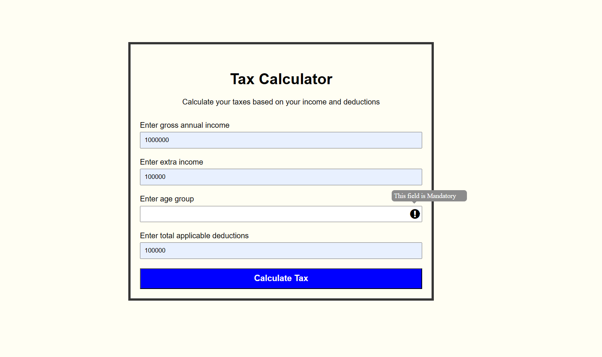
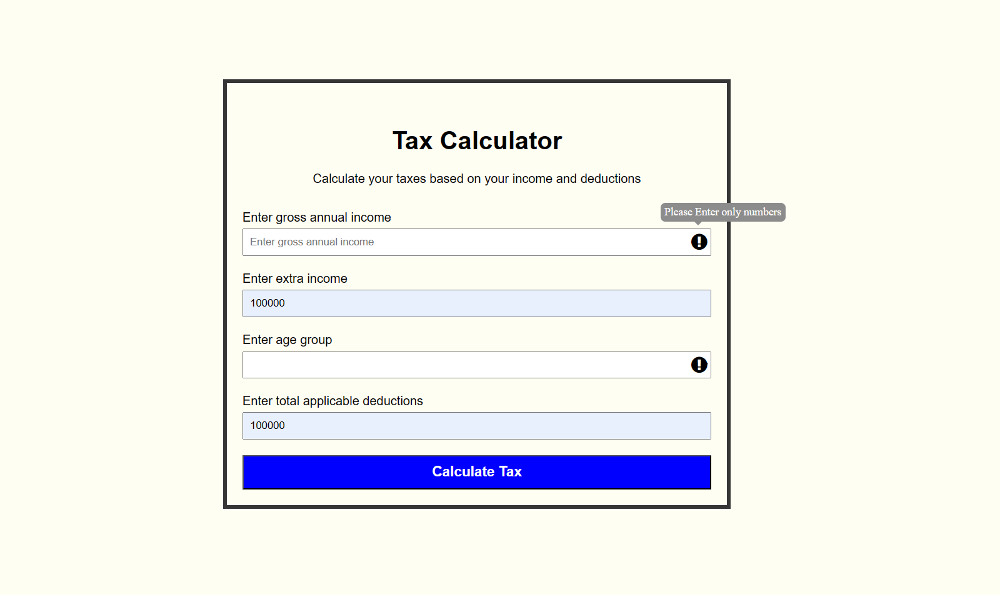

# Tax Calculation Application

## Description
The Tax Calculation Application is a web-based tool designed to help users calculate their tax liability based on their annual income, extra income, age and deductions. It provides a simple and intuitive interface for users to input their financial information and receive a calculated tax amount along with overall income after tax deduction.

## Features
- Calculates taxes based on annual income, extra income, age and deductions.
- Handles error scenarios such as invalid inputs with error icons and tooltips.
- Displays the calculated tax and overall income amount in a modal window for easy reference.
- Supports different tax rates based on the user's age category (<40, >=40 & <60, >=60).

## Technologies Used
- HTML
- CSS
- JavaScript

## Getting Started
To run the Tax Calculation Application locally:
1. Clone the repository: `git clone <repository-url>`
2. Open `index.html` in a web browser.

## Usage
1. Select your age category from the dropdown menu (<40, >=40 & <60, >=60).
2. Enter your annual income,extra income and deductions in the respective input fields.
3. Click the "Calculate Tax" button to calculate your tax.

## Error Handling
- Error icons are displayed next to input fields for invalid inputs.
- Hovering over the error icons reveals tooltips with error messages.

## Contact
For any questions or feedback regarding the Tax Calculation Application, feel free to contact the project maintainer at [sathyabalajic697@gmail.com].
## Demo
You can try out the Tax Calculation Application live [https://sathyabalajic.github.io/tax_calculator/].

## Screenshots

